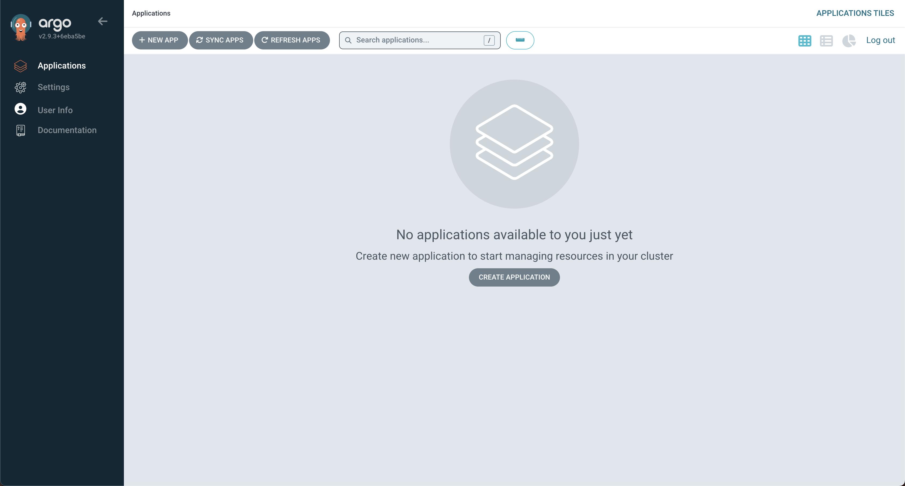

# How to manage ArgoCD with ArgoCD

## Installing ArgoCD

### Using Helm

```bash
# clone repo
git clone git@github.com:alfathmas/argocd.git
cd argocd-manage-itself

# create ns
kubectl create ns argocd

# install
helm install argocd apps/charts/argo-cd --namespace argocd

# create a port forwarding on your local
kubectl port-forward service/argocd-server -n argocd 8080:443
```


```bash
# check the admin password with running this command
kubectl -n argocd get secret argocd-initial-admin-secret -o jsonpath="{.data.password}" | base64 -d
```



## Add repository

## Defining Argo CD Applications as Code